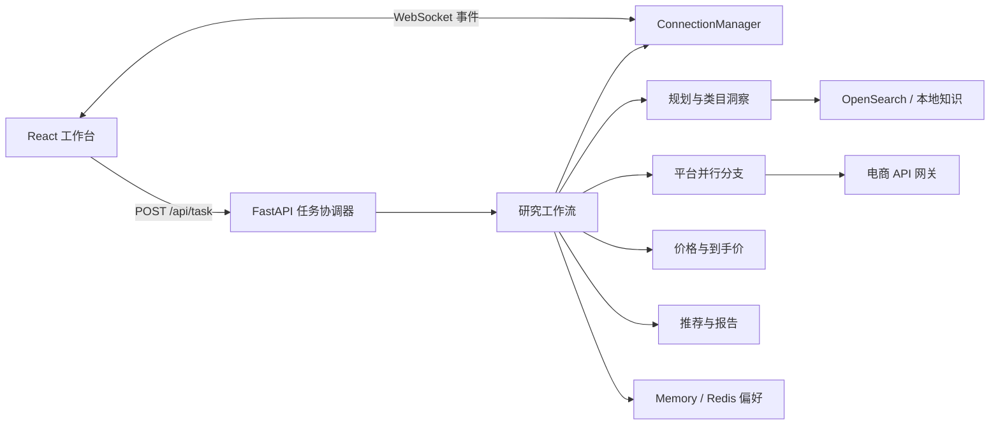

# Shopping Agent

[](https://github.com/cui282/shopping-agent/actions/workflows/ci.yml)

Shopping Agent 是一个前后端完整的跨平台购物研究工作台。用户提交预算、品类与硬约束后，Python 服务会并行查询已配置的电商网关，统一价格口径，估算运费与税费，并生成最多 3 个可追溯推荐。React 工作台通过 WebSocket 展示实际执行阶段、平台状态、降级原因和最终对比。

项目把可用性与数据真实性分开处理：`/api/health` 只表示进程存活，`/api/readiness` 才表示能否接受研究任务。默认配置不会静默生成商品；只有显式设置 `SANDBOX_MODE=true` 时才会使用固定的评估数据。

## 当前能力

- FastAPI 异步任务 API，支持超时、取消、请求 ID 和线程级快照
- React、TypeScript、Vite 三栏研究工作台
- Think -> Act -> Observe -> Reflect 规则编排，可选 OpenAI-compatible 模型辅助意图分析
- Amazon、Shopee、AliExpress、eBay 网关适配器并行检索
- 9 个类型化购物工具，覆盖规划、类目、检索、筛选、价格、到手价和总结
- AGUI 风格 WebSocket 事件，支持连接前缓冲和断线重连
- live、mixed、sandbox 三种结果来源状态
- Redis 偏好存储、OpenSearch 类目知识库、Faiss 与三塔召回扩展边界
- Markdown、JSON 报告和受控文件下载
- GitHub Actions、Dependabot 和统一的 `make verify` 质量门禁

图片上传接口会校验 MIME、文件签名和大小，但当前没有接通图像理解链路。`/api/readiness` 因此返回 `image_analysis=false`，前端不会把上传入口展示成可用搜索能力。

## 架构



HTTP 层负责接纳、协调和恢复任务状态。每个任务使用独立 `thread_id`、输出目录和上下文；平台调用并发执行，结果统一映射到 Pydantic 模型。服务端只保留提供方实际返回的可选字段，不补造评分、销量、图片或商品链接。

## 技术栈

| 层 | 技术 |
| --- | --- |
| 后端 | Python 3.10+、FastAPI、Pydantic、asyncio、Uvicorn |
| Agent | LangChain、LangGraph、规则工作流、OpenAI-compatible 模型边界 |
| 前端 | React 19、TypeScript、Vite、Lucide icons、CSS Modules |
| 检索 | OpenSearch hybrid query、Faiss、三塔 HTTP 扩展点 |
| 记忆 | 进程内 Store 或 Redis TTL Store |
| 部署 | Docker Compose、Nginx WebSocket 反向代理 |

## 目录

```text
.
├── app/
│   ├── agent/          # 工作流、模型边界、提示词和分支调度
│   ├── api/            # FastAPI、任务状态和 WebSocket
│   ├── tools/          # 9 个购物工具与提供方适配器
│   ├── memory/         # 偏好存储
│   ├── recall/         # ANN 与三塔客户端
│   ├── compress/       # 上下文压缩
│   └── eval/           # Rubric、trace 和评估入口
├── frontend/           # React 工作台
├── tests/backend/      # 后端与 API 测试
├── docs/               # 接口契约和 Agent 维护规则
├── examples/           # live、sandbox 和客户端示例
├── docker/             # 镜像、Nginx 和 OpenSearch 初始化
├── AGENTS.md           # Agent 项目地图和验证约束
├── DESIGN.md           # 前端设计系统
└── Makefile            # 稳定开发与 CI 命令
```

## 本地启动

前置条件：Python 3.10+、[uv](https://docs.astral.sh/uv/) 和 Node.js 22。

### 1. 安装依赖

```bash
make install
```

### 2. 选择运行配置

使用固定评估数据验证完整流程：

```bash
cp examples/sandbox.env.example .env
```

连接真实平台时，从默认模板开始并填写至少一组完整的 endpoint/key：

```bash
cp .env.example .env
```

### 3. 启动前后端

分别在两个终端运行：

```bash
make dev-backend
```

```bash
make dev-frontend
```

打开 `http://127.0.0.1:5173`。Vite 会把 `/api` 与 `/ws` 代理到 `http://127.0.0.1:8000`。

检查进程和任务就绪状态：

```bash
curl --fail http://127.0.0.1:8000/api/health
curl --fail http://127.0.0.1:8000/api/readiness
```

`task_ready=false` 时，响应中的 `required_actions` 会列出缺失配置；此时 `POST /api/task` 返回带 `runtime_not_ready` 错误码的 HTTP 503。

## 连接真实 API

部署模板位于 [examples/live.env.example](examples/live.env.example)。生产环境必须保持：

```dotenv
APP_ENV=production
SANDBOX_MODE=false
ALLOW_FIXTURE_FALLBACK=false
```

至少配置一个平台网关：

```dotenv
AMAZON_API_ENDPOINT=https://gateway.example.com/amazon/search
AMAZON_API_KEY=replace-me
SHOPEE_API_ENDPOINT=https://gateway.example.com/shopee/search
SHOPEE_API_KEY=replace-me
```

Shopping Agent 向每个 endpoint 发送 `GET` 请求，查询参数为 `query` 和 `top_k`，并同时发送 `Authorization: Bearer <key>` 与 `X-API-Key: <key>`。密钥只由后端读取，不应进入 Vite 环境变量或浏览器代码。

网关可返回顶层数组，也可用 `items`、`products` 或 `data` 包装：

```json
{
  "items": [
    {
      "item_id": "provider-item-id",
      "title": "商品标题",
      "price": 129.99,
      "currency": "USD",
      "rating": 4.7,
      "sales": 2384,
      "image_url": "https://cdn.example.com/item.jpg",
      "product_url": "https://shop.example.com/item",
      "attributes": {"weight_kg": 0.24, "material": "织物"}
    }
  ]
}
```

必需字段是标题、价格和币种。适配器支持常见字段别名；缺少 ID 时会根据平台、标题和链接生成稳定标识。其他缺失字段保留为 `null`。

### 模型与中间件

- `AGENT_MODE=auto` 在 `OPENAI_API_KEY` 和 `LLM_MAIN` 完整时启用模型辅助意图分析，否则使用规则规划。
- `ALLOW_RULES_FALLBACK=false` 可要求模型配置完整，否则运行状态不可用。
- `web_search` 提供 Tavily 适配器扩展点，但尚未接入默认研究工作流；仅设置 `TAVILY_API_KEY` 不会改变推荐结果。
- `STORE_BACKEND=redis` 与 `STORE_REDIS_URL` 启用带 TTL 的持久偏好；生产 readiness 会提示不要使用内存 Store。
- `OPENSEARCH_URL` 等变量启用类目知识检索；没有向量时使用 BM25，并披露降级原因。
- `ANN_BACKEND=faiss` 与三个 `TOWER_*_ENDPOINT` 是个性化召回扩展点，不会默认启用。

跨币种排序应配置可维护的汇率快照：

```dotenv
FX_RATES_JSON={"CNY":1,"USD":7.21,"EUR":7.84,"SGD":5.34}
FX_RATE_SOURCE=treasury-daily-feed
FX_RATES_AS_OF=2026-07-30
```

未提供时，系统会使用内置参考表，并在结果中明确标记来源与日期未指定。运费和税费始终是估算值，购买前应以平台结算页为准。
部分候选缺少汇率时会被排除并在结果中披露；如果全部候选都无法换算，任务会以 `fx_rates_unavailable` 明确失败，不会伪装成“没有合适商品”。

## API 与事件

完整字段见 [docs/API_CONTRACT.md](docs/API_CONTRACT.md)。启动任务：

```bash
curl --fail-with-body \
  --request POST \
  --header 'Content-Type: application/json' \
  --data '{"query":"预算 1200 元，找一款轻便降噪耳机，不要皮革","user_id":"local-client","upload_ids":[]}' \
  http://127.0.0.1:8000/api/task
```

服务立即返回 HTTP 202 和 `thread_id`。客户端随后连接 `WS /ws/{thread_id}`，并按 `event` 字段处理 `session_created`、`assistant_call`、`tool_start`、`tool_end`、`fork`、`task_result`、`task_cancelled` 和 `error`，不要依赖中文消息文本判断状态。

主要端点：

```text
GET    /api/health
GET    /api/readiness
POST   /api/task
GET    /api/task/{thread_id}
POST   /api/task/{thread_id}/cancel
POST   /api/upload
GET    /api/files/{thread_id}/{name}
GET    /api/preferences/{user_id}
DELETE /api/preferences/{user_id}
WS     /ws/{thread_id}
```

每个 HTTP 响应都包含 `X-Request-ID`，也会接受格式合法的客户端请求 ID，便于关联日志。

## Docker Compose

先选择 live 或 sandbox 配置，再启动：

```bash
cp examples/sandbox.env.example .env
make compose-up
```

访问 `http://127.0.0.1:8080`。Compose 同时启动 Redis、OpenSearch、后端和 Nginx 前端；后端健康检查使用 readiness，因此配置不完整时前端不会被标记为可用。

只启动中间件：

```bash
make infra-up
make opensearch-init
```

停止服务不会删除命名卷：

```bash
make compose-down
```

本地 OpenSearch 关闭了安全插件，只能绑定开发机回环地址，不能暴露到公网。

## 验证

本地与 CI 使用同一入口：

```bash
make verify
```

它依次执行 Ruff lint/format 检查、后端测试、前端 Vitest 和生产构建。接口字段变化必须同步更新 Pydantic schema、前端 TypeScript 类型、测试和 `docs/API_CONTRACT.md`。

## 数据与安全边界

- 当前 API 不包含登录或租户鉴权。对外部署时必须置于可信身份网关之后，并按身份校验 `user_id`、`thread_id` 和文件访问。
- 浏览器会生成本地匿名 ID，用于隔离同一浏览器中的偏好；它不是认证凭据。
- 任务快照与报告写入 `output/`，上传写入 `uploaded/`，两者均不纳入 Git。
- 生产部署需要为任务、报告、上传和 Redis 偏好实现统一到期清理与用户删除流程。
- CORS 必须使用明确来源；日志和事件不能包含密钥、Authorization 头或未脱敏隐私数据。
- 商品价格、库存、运费和税费可能变化，推荐不构成平台库存或价格承诺。

更完整的开发约束见 [AGENTS.md](AGENTS.md)，界面规范见 [DESIGN.md](DESIGN.md)。
