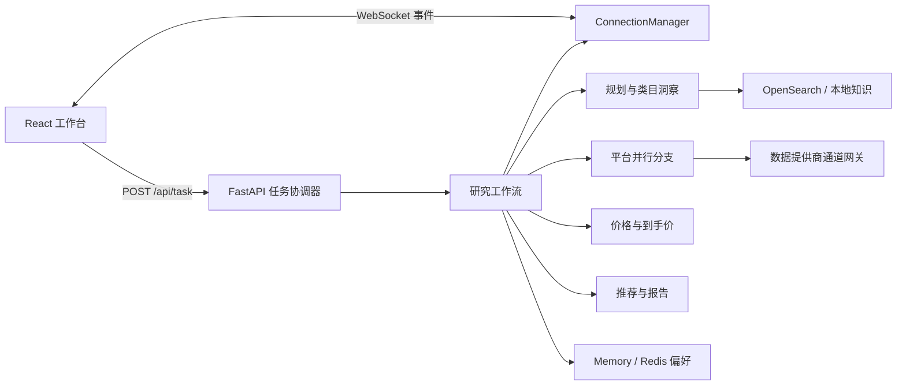

# Shopping Agent

[](https://github.com/cui282/shopping-agent/actions/workflows/ci.yml)

Shopping Agent 是一个前后端完整的跨平台购物研究工作台。用户提交预算、品类与硬约束后，Python 服务会并行查询已配置的数据提供商通道网关，统一价格口径，估算运费与税费，并生成最多 3 个可追溯推荐。React 工作台通过 WebSocket 展示实际执行阶段、平台状态、降级原因和最终对比。

项目把可用性与数据真实性分开处理：`/api/health` 只表示进程存活，`/api/readiness` 才表示能否接受研究任务。默认配置不会静默生成商品；只有显式设置 `SANDBOX_MODE=true` 时才会使用固定的本地验证数据。

## 当前能力

- FastAPI 异步任务 API，支持超时、取消、请求 ID 和线程级快照
- React、TypeScript、Vite 三栏研究工作台
- Think -> Act -> Observe -> Reflect 规则编排，可选 OpenAI-compatible 模型辅助意图分析
- Amazon、Shopee、AliExpress、eBay 数据提供商通道网关适配器并行检索
- 9 个类型化购物工具，覆盖规划、类目、检索、筛选、价格、到手价和总结
- AGUI 风格 WebSocket 事件，支持连接前缓冲和断线重连
- Live Result、Sandbox Result 与 Partial Result；开发诊断模式会额外披露 mixed source
- Redis 偏好存储与可选 OpenSearch、Faiss、推理型 Query/Item 双塔召回；未配置能力会在 readiness 中明确标记
- LangGraph 只负责受限意图/执行计划，商品证据、价格、资格和排序由确定性工具完成；项目不包含 SFT、Agentic RL 或微调流程
- Markdown、JSON、PDF 报告和受控文件下载
- GitHub Actions、Dependabot 和统一的 `make verify` 质量门禁

图片上传接口会校验 MIME、文件签名和大小，但当前没有接通图像理解链路。`/api/readiness` 因此返回 `image_analysis=false`，前端不会把上传入口展示成可用搜索能力。

## 架构



HTTP 层负责接纳、协调和恢复任务状态。每个任务使用独立 `thread_id`、输出目录和上下文；平台调用并发执行，结果统一映射到 Pydantic 模型。服务端只保留提供方实际返回的可选字段，不补造评分、销量、图片或商品链接。

## 技术栈

| 层 | 技术 |
| --- | --- |
| 后端 | Python 3.10+、FastAPI、Pydantic、asyncio、Uvicorn |
| Agent | LangChain、LangGraph、规则工作流、OpenAI-compatible 模型边界 |
| 前端 | React 19、TypeScript、Vite、Lucide icons、CSS Modules |
| 检索 | OpenSearch hybrid query、Faiss、Query/Item 双塔与可选推理 reranker |
| 记忆 | 进程内 Store 或 Redis TTL Store |
| 部署 | Docker Compose、Nginx WebSocket 反向代理 |

## 目录

```text
.
├── app/
│   ├── agent/          # 工作流、模型边界、提示词和分支调度
│   ├── api/            # FastAPI、任务状态和 WebSocket
│   ├── tools/          # 9 个购物工具与提供方适配器
│   ├── memory/         # 偏好存储
│   ├── recall/         # ANN、Query/Item 双塔、RAG 与 reranker 客户端
│   ├── compress/       # 上下文压缩
│   └── prompt/         # 系统提示词配置
├── frontend/           # React 工作台
├── tests/backend/      # 后端与 API 测试
├── docs/               # 接口契约和 Agent 维护规则
├── examples/           # live、sandbox 和客户端示例
├── docker/             # 镜像、Nginx 和 OpenSearch 初始化
├── AGENTS.md           # Agent 项目地图和验证约束
├── DESIGN.md           # 前端设计系统
└── Makefile            # 稳定开发与 CI 命令
```

## 本地启动

前置条件：Python 3.10+、[uv](https://docs.astral.sh/uv/) 和 Node.js 22。

### 1. 安装依赖

```bash
make install
```

### 2. 选择运行配置

使用固定的 sandbox 商品数据验证完整流程：

```bash
cp examples/sandbox.env.example .env
```

接入数据提供商的 live 通道时，从默认模板开始并填写至少一组完整的 provider/channel endpoint/credential：

```bash
cp .env.example .env
```

### 3. 启动前后端

分别在两个终端运行：

```bash
make dev-backend
```

```bash
make dev-frontend
```

打开 `http://127.0.0.1:5173`。Vite 会把 `/api` 与 `/ws` 代理到 `http://127.0.0.1:8000`。

检查进程和任务就绪状态：

```bash
curl --fail http://127.0.0.1:8000/api/health
curl --fail http://127.0.0.1:8000/api/readiness
```

`task_ready=false` 时，响应中的 `required_actions` 会列出缺失配置；此时 `POST /api/task` 返回带 `runtime_not_ready` 错误码的 HTTP 503。

## Self-hosted Beta runbook

### 可复现的本地 Sandbox 流程

Sandbox 是开发和验收模式，不是登录、鉴权或生产数据源。完整的最小流程如下：

```bash
cp examples/sandbox.env.example .env
make install
make dev-backend       # 终端一：127.0.0.1:8000
make dev-frontend      # 终端二：127.0.0.1:5173
curl --fail http://127.0.0.1:8000/api/health
curl --fail http://127.0.0.1:8000/api/readiness
```

两项开发服务分别用 `Ctrl-C` 停止。浏览器访问 `http://127.0.0.1:5173`；Vite 将 `/api` 和 `/ws` 代理到后端。Sandbox 只有在 `.env` 明确设置 `SANDBOX_MODE=true` 且 `APP_ENV` 不是 `production` 时才会启用固定 fixture。未配置 live 数据提供商通道的 live runtime 会保持 `task_ready=false`，创建任务返回 HTTP 503，不会悄悄改用 fixture。

### 数据提供商通道接入

每个 marketplace 都必须同时设置对应的 `*_DATA_CHANNEL_ENDPOINT` 和 `*_DATA_CHANNEL_CREDENTIAL`，并可选设置 `*_DATA_PROVIDER` 作为数据提供商标识。这里的 endpoint 和 credential 是数据提供商为该平台数据通道分配的服务地址与接入凭证，不是 Amazon、Shopee、AliExpress 或 eBay 的官方 API 凭证。旧部署仍可使用 `*_API_ENDPOINT` 与 `*_API_KEY` 别名，但不要跨两套变量各填一半，也不要同时设置两套不同值。Shopping Agent 调用的是数据提供商的检索接口，接口返回契约中的 normalized offer；数据提供商或其 Gateway 负责处理上游平台的授权、签名和数据采购。通道凭证只放在后端或 Compose 环境中，不能放入 `frontend` 的 Vite 变量或浏览器存储。配置不完整时 `/api/readiness` 会显示 `unavailable` 或 `degraded` 及 `reason_code`，生产环境不会接受任务。

### Docker Compose 流程与数据目录

```bash
cp examples/sandbox.env.example .env
make compose-up
curl --fail http://127.0.0.1:8080/api/health
curl --fail http://127.0.0.1:8080/api/readiness
make compose-down
```

Compose 启动 Redis、OpenSearch、backend 和 Nginx frontend；`opensearch-init` 只在需要建立类目索引时运行：

```bash
make opensearch-init
```

运行时数据分别位于 `output/`（任务快照和报告）、`uploaded/`（上传文件）和 `data/`（可选 Faiss 索引）。Compose 使用 `redis_data`、`opensearch_data`、`shopping_agent_output`、`shopping_agent_uploaded`、`shopping_agent_data` 命名卷；`make compose-down` 不删除这些卷。仓库不提交这些目录中的运行时内容。Compose 没有内置数据提供商通道网关或 tower 服务；live 通道、Faiss 索引和 tower endpoint 必须由部署者提供并显式配置。

### Readiness 与故障排查

`/api/health` 只检查进程存活。`/api/readiness` 额外列出 LLM、每个平台的数据提供商通道、Redis、OpenSearch、Faiss、Query/Item 双塔、兼容用 User Tower、storage 和 image analysis 的 `configured`、`ready`、`state`、`reason_code`、`reason`。默认 `RECALL_ARCHITECTURE=dual` 时 User Tower 会明确显示 `dual_tower_architecture`/`disabled`；只有未显式指定架构且旧部署仍提供 `TOWER_USER_ENDPOINT` 时才启用兼容路径。网络型依赖采用保守的配置观察：`configured`/`configured_not_probed` 不代表已成功连接；真实任务事件会披露实际 `ok`、`degraded` 或 `unavailable`。只有明确可验证的本地 storage 才会标为 `ready`。`image_analysis=false` 时只能上传和保存文件，界面不提供 Reference Image 搜索入口。

启动异常时按以下顺序检查：

```bash
docker compose --profile app ps
docker compose --profile app logs --tail=200 backend frontend
curl --fail-with-body http://127.0.0.1:8000/api/readiness
```

如果 backend healthcheck 不通过，先读取 `required_actions` 和 `components.*.reason`；常见原因是 live 没有完整 gateway、生产误启用 Sandbox/诊断模式、Redis 只剩内存 fallback，或 `output`、`uploaded`、`data` 不可写。OpenSearch/tower/Faiss 是可选能力，缺失时应看到明确降级而不是“ready”；补齐配置后重新启动并重新检查 readiness。

## 接入数据提供商 live 通道

部署模板位于 [examples/live.env.example](examples/live.env.example)。生产环境必须保持：

```dotenv
APP_ENV=production
SANDBOX_MODE=false
ALLOW_FIXTURE_FALLBACK=false
DEVELOPER_DIAGNOSTIC_MODE=false
```

至少配置一个数据提供商平台通道：

```dotenv
# 这些是数据提供商通道的标识、endpoint 和接入凭证，不是平台官方 API key。
AMAZON_DATA_PROVIDER=licensed-catalog-vendor
AMAZON_DATA_CHANNEL_ENDPOINT=https://gateway.example.com/amazon/search
AMAZON_DATA_CHANNEL_CREDENTIAL=replace-me
SHOPEE_DATA_PROVIDER=licensed-catalog-vendor
SHOPEE_DATA_CHANNEL_ENDPOINT=https://gateway.example.com/shopee/search
SHOPEE_DATA_CHANNEL_CREDENTIAL=replace-me
```

Shopping Agent 向数据提供商通道 endpoint 发送 `GET` 请求，查询参数为 `query` 和 `top_k`，并同时发送 `Authorization: Bearer <credential>` 与 `X-API-Key: <credential>`。这里的请求头用于验证 Shopping Agent 到数据提供商 Gateway 的调用，不代表 Shopping Agent 直接向上游平台鉴权。凭证只由后端读取，不应进入 Vite 环境变量或浏览器代码。

网关可返回顶层数组，也可用 `items`、`products`、`results`、`offers` 或 `data` 包装；
`data` 也可再包一层这些集合字段：

```json
{
  "items": [
    {
      "offer_id": "provider-offer-id",
      "title": "商品标题",
      "price": 129.99,
      "currency": "USD",
      "rating": 4.7,
      "sales": 2384,
      "image_url": "https://cdn.example.com/item.jpg",
      "product_url": "https://shop.example.com/item",
      "link_kind": "product_detail",
      "availability": "in_stock",
      "retrieved_at": "2026-07-30T10:00:00Z",
      "identity": {
        "gtin": "4006381333931",
        "brand": "Acme",
        "model": "X1"
      },
      "variant_attributes": {"capacity": "256 GB", "condition": "new"},
      "provenance": {
        "provider": "licensed-marketplace-feed",
        "source": "upstream-catalog"
      }
    }
  ]
}
```

必需字段是标题、非负有限价格和币种。适配器支持书面 API 契约中的 wrapper 与字段
别名。缺少平台 offer ID 时，`offer_id` 保持 `null`；系统可另行生成仅供内部列表使用的
`item_id`，但不会把它当作跨平台身份或真实 offer 标识。其他未知可选字段保留为
`null`，不会交给模型补全。

数据提供商 Gateway 或部署者维护的 Marketplace Gateway 负责上游平台的 OAuth/鉴权、签名、地区参数、分页、限流和
原始字段映射。Shopping Agent 只接收 normalized offer。Product Detail Link 必须是 gateway
随具体 offer 返回的安全 HTTP(S) URL；搜索页必须使用 `marketplace_search`，Sandbox 结果
也只提供这种链接。完整字段、alias、provenance 与时间戳规则见
[API 契约](docs/API_CONTRACT.md#marketplace-gateway-search-contract)。

### 模型与中间件

- `AGENT_MODE=auto` 在 `OPENAI_API_KEY` 和 `LLM_MAIN` 完整时启用模型辅助意图分析，否则使用规则规划。
- `LLM_REASONING_EFFORT` 可选地把供应商支持的推理档位传给 OpenAI-compatible 模型；`LLM_WIRE_API=responses` 使用 Responses API，`LLM_RESPONSE_STORAGE=false` 映射为 `store=false`。
- `LLM_LITE`、`LLM_MINIMAL` 和 `LLM_FALLBACK` 是可选的低成本模型路由；未配置时回落到 `LLM_MAIN`，不会改变确定性工具边界。
- `ALLOW_RULES_FALLBACK=false` 可要求模型配置完整，否则运行状态不可用。
- `web_search` 提供 Tavily 适配器扩展点，但尚未接入默认研究工作流；仅设置 `TAVILY_API_KEY` 不会改变推荐结果。
- `STORE_BACKEND=redis` 与 `STORE_REDIS_URL` 启用带 TTL 的持久偏好；生产 readiness 会提示不要使用内存 Store。
- `OPENSEARCH_URL` 等变量启用类目知识检索；配置后它会进入研究路径并披露请求或语义降级原因。
- `ANN_BACKEND=faiss`、`ANN_INDEX_PATH`、`TOWER_QUERY_ENDPOINT` 和 `TOWER_ITEM_ENDPOINT` 启用不训练的 Query/Item 双塔候选召回；缺少任一可选 channel 时 readiness 与结果会显示稳定降级原因，并保留确定性 fallback。
- `RERANKER_ENDPOINT` 可接入已训练好的外部推理 reranker；服务只发送查询和已有 Product Evidence，不在本项目内训练或微调。
- `TOWER_USER_ENDPOINT` 仅为旧部署保留兼容路径。默认双塔不会调用它，也不会把查询、Task Override 或隐式行为编码成用户向量；显式 Remembered Preference 仍可作为确定性记忆输入并披露来源。
- Agent loop 默认限制 fork 深度、子分支数量、全局子分支并发、工具调用次数、重复调用和单次工具结果长度；provider 适配器统一使用重试退避、每 provider 并发隔离和 circuit breaker。
- `AUTH_ENABLED=true` 时，可信 identity gateway 注入 `X-Auth-User`/`X-Auth-Tenant`，任务、WebSocket、上传、报告、文件和偏好都按 tenant ownership 隔离；`RATE_LIMIT_ENABLED=true` 启用进程内保护，多 worker 仍需共享 gateway/Redis 限流。
- `RELEASE_CHANNEL=canary` 与 `RELEASE_TRAFFIC_PERCENT` 提供确定性灰度 gate，`RELEASE_ROLLBACK=true` 停止接收新任务；收到 SIGTERM 后会等待 `SHUTDOWN_GRACE_SECONDS` 再取消剩余长任务。
- `LLM_TOKEN_BUDGET` 可启用 main/lite/minimal 路由；LangFuse 配置后主 trace、Fork 子 span 和工具 span 使用 thread/parent thread 形成嵌套链路，仍需额外安装 SDK。

线上到手价不使用进程级静态汇率表，也不按平台和假定重量套运费档位。数据提供商必须随每个
非人民币 offer 返回带观测时间、有效期、报价类型、加价口径、来源和引用的
`price_conversion`；并返回面向中国大陆、绑定线路和运输服务的 `shipping_quote`。运费报价保留
原币总额、基础运费、附加费、优惠、实际/体积/计费重量、时效、来源和有效期；外币运费还要携带
独立的人民币换算证据。缺失、无效或过期证据的候选保留在 Product Evidence 中，但不会参与到手价
排序；全部商品无法换算时任务以 `fx_rates_unavailable` 明确失败。

用于客户横向比较的报价汇率、支付结算汇率和海关计税汇率是三个不同口径。一般贸易和跨境电商
的 `customs.valuation` 必须另外返回申报月海关汇率及 CIF 完税价格明细，不能复用客户比价汇率。
进口税率仍按 HS Code、原产地、进口模式和生效日期提供，不按平台名套固定比例。个人邮递物品
另行校验个人自用资格、政策限值、不可分割单件例外和免税门槛。最终支付金额、承运费用和税费以
平台结算页、发卡行、承运商与海关核定为准。完整规则见
[汇率与运费实现边界](docs/FX_AND_SHIPPING.md)和[进口税费实现边界](docs/IMPORT_TAX.md)。

## API 与事件

完整字段见 [docs/API_CONTRACT.md](docs/API_CONTRACT.md)。启动任务：

```bash
curl --fail-with-body \
  --request POST \
  --header 'Content-Type: application/json' \
  --data '{"query":"预算 1200 元，找一款轻便降噪耳机，不要皮革","user_id":"local-client","upload_ids":[]}' \
  http://127.0.0.1:8000/api/task
```

服务立即返回 HTTP 202 和 `thread_id`。客户端随后连接 `WS /ws/{thread_id}`，并按 `event` 字段处理 `session_created`、`assistant_call`、`tool_start`、`tool_end`、`fork`、`task_result`、`task_cancelled` 和 `error`，不要依赖中文消息文本判断状态。

主要端点：

```text
GET    /api/health
GET    /api/readiness
POST   /api/task
GET    /api/task/{thread_id}
POST   /api/task/{thread_id}/cancel
DELETE /api/task/{thread_id}
POST   /api/upload
GET    /api/files/{thread_id}/{name}
GET    /api/preferences/{user_id}
DELETE /api/preferences/{user_id}
WS     /ws/{thread_id}
```

每个 HTTP 响应都包含 `X-Request-ID`，也会接受格式合法的客户端请求 ID，便于关联日志。

## Docker Compose

先选择 live 或 sandbox 配置，再启动：

```bash
cp examples/sandbox.env.example .env
make compose-up
```

访问 `http://127.0.0.1:8080`。Compose 同时启动 Redis、OpenSearch、后端和 Nginx 前端；后端健康检查使用 readiness，因此配置不完整时前端不会被标记为可用。默认 Compose 不提供 live 数据提供商通道网关、tower 服务或 Faiss 索引。

只启动中间件：

```bash
make infra-up
make opensearch-init
```

停止服务不会删除命名卷：

```bash
make compose-down
```

本地 OpenSearch 关闭了安全插件，只能绑定开发机回环地址，不能暴露到公网。

## 验证

本地与 CI 使用同一入口：

```bash
make verify
```

它依次执行 Ruff lint/format 检查、后端测试、前端 Vitest、生产构建，以及使用受控 FastAPI backend 的真实 Chromium 浏览器验收。浏览器门禁覆盖 10 个任务状态（task-ready、running、awaiting-clarification、partial、no-match、empty、error、cancelled、completed、developer diagnostic mixed）和 1280px、375px、320px 三种视口，不调用外部 live API。接口字段变化必须同步更新 Pydantic schema、前端 TypeScript 类型、测试和 `docs/API_CONTRACT.md`。

## 数据与安全边界

- 当前 API 不包含登录或租户鉴权。对外部署时必须置于可信身份网关之后，并按身份校验 `user_id`、`thread_id` 和文件访问。
- 浏览器会生成本地 Anonymous Shopper ID，用于隔离同一浏览器中的研究与显式偏好；它不是登录账号、认证身份、认证凭据或数据所有权证明。
- 任务快照与报告写入 `output/`，上传写入 `uploaded/`，两者均不纳入 Git。
- 生产部署需要为任务、报告、上传和 Redis 偏好实现统一到期清理与用户删除流程。
- CORS 必须使用明确来源；日志和事件不能包含密钥、Authorization 头或未脱敏隐私数据。
- 商品价格、库存、运费和税费可能变化，推荐不构成平台库存或价格承诺。

更完整的开发约束见 [AGENTS.md](AGENTS.md)，界面规范见 [DESIGN.md](DESIGN.md)。
